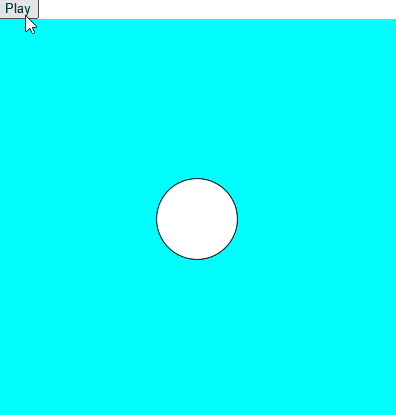

# Music Visualizer 🎶
Basic music visualizer project using p5.js \
This visualizes the audio file provided by changing the radius of a circle, drawn on the canvas.

---

## 🎥 Demo


*(Music visualizer running in the browser)*

---

## 🚀 Features
- Diameter of the circle, **linked to the amplitude of the sound wave.**
- Background changes, as the bass increases or decreases.
- Supported by **p5 sound library**.

---

## 💻 How it works
1. Load the audio wave, manually.
2. Using **p5 sound library**, getting the amplitude of the sound wave.
3. Using the same library, changing the background color as per the notes changes.
4. Interactive start and stop button to trigger the visualizer.

---

## 🛠 Tech-Stack
- **HTML & CSS** - for base.
- **p5.js** - for sound and rendering.

---

## ▶ Installation
- Clone the repo
    ```bash
    git clone https://github.com/Serwindev/music-visualizer.git
    cd music-visualizer

- Open index.html in the browser

---

## 🤝 Contributions

Contributions are welcome! If you’d like to improve the simulation or add features, feel free to fork this repo and open a pull request.

---

## 📜 License

This project is licensed under the MIT License.

---

## 👨‍💻 Developer

Dev-ed with ❤️ by Serwin

